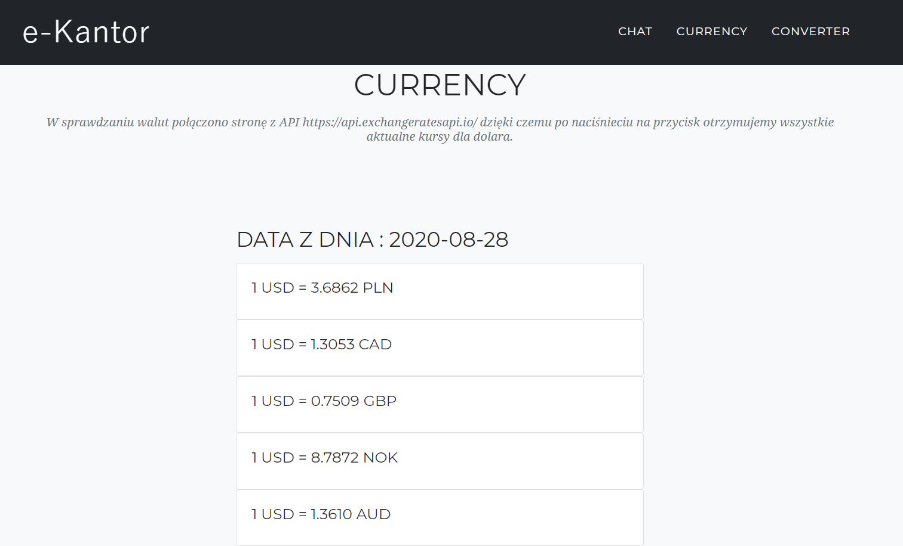
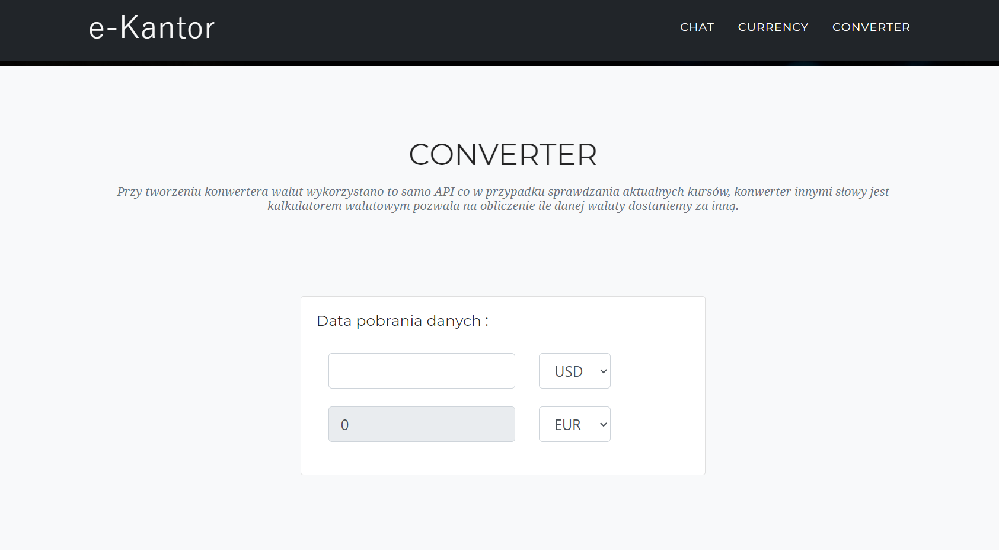
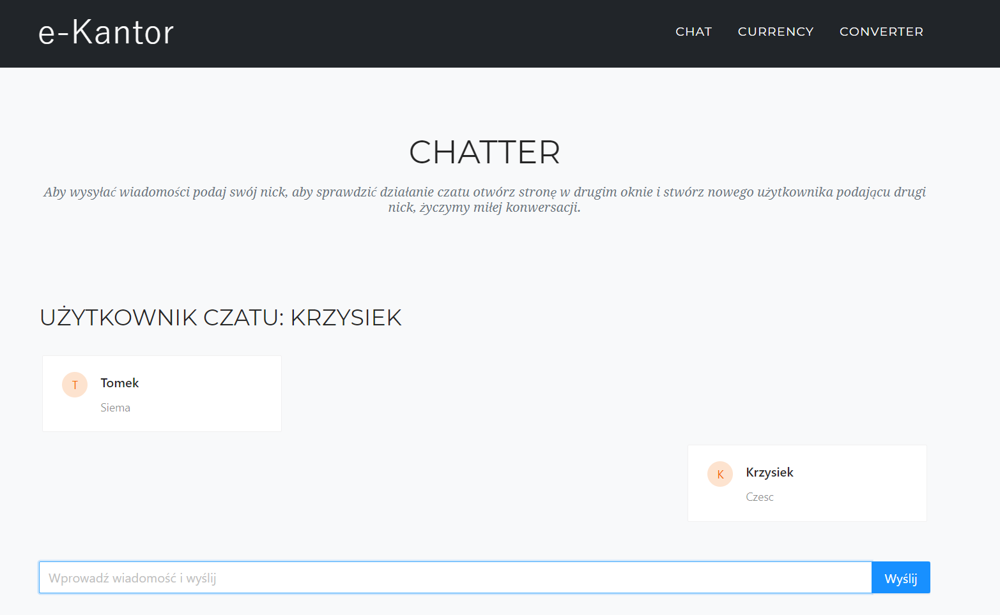
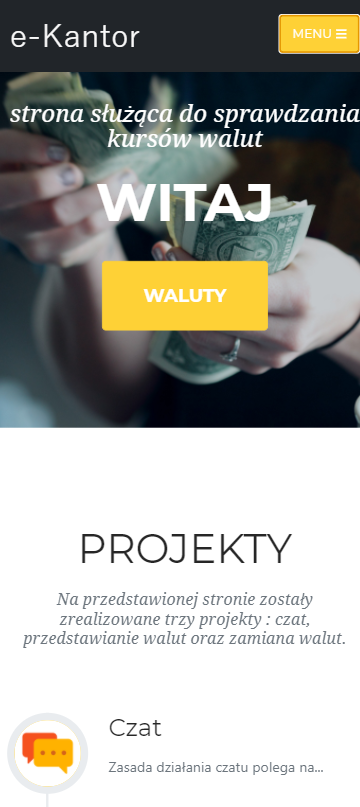

# University project - "Kantor walut"

## Spis treści 
* [Cel](#cel-)
* [Założenia](#założenia-)
* [Osiągnięcia](#osiągnięcia-)
* [Instalacja](#instalacja-)
* [Opracowanie teoretyczne](#opracowanie-teoretyczne-)

## Cel :
Strona została założona jako projekt na przedmiot "Protokoły wymiany danych w systemach" 

## Założenia : 
* Stworzyć prosty serwer www generujący lokalną stronę WWW w sposób dynmiczny
* Stworzyć czat pozwalający na wymianę wiadomości między użytkownikami
* Stworzyć program automatycznie pobierający kursy walut – klienta WWW

### Osiągnięcia : 
W związku z pomysłem na rozwinięcie projektu wraz z Tomaszem Gruzdzisem uznaliśmy podjąć wspólną pracę, dzięki temu powstała strona e-kantor.
Strona ta zawiera wszystkie elementy założeń, jest wpełni responsywna oraz została rozwinięta o konwerter walutowy. 

Zdecydowano się na stworzenie strony w React.js wykorzystujący przy tym : 
* HTML5
* CSS
* JavaScript
* Bootstrap
* Material-UI
* W3cwebsocket

## Instalacja : 
W celu włączenia projektu należy :

### 1. Pobrać repozutorium 
```
git clone https://github.com/kicky1/CurrencyWebsite.git
```
### 2. Posiadać zainstalowanego Reacta oraz Node.js
Wersja : 
* npm >= 6.14.6
* node >= v12.18.3
### 3. Pobrać npm dla obu folderów Chat_Server oraz CurrencyWebsite
```
npm install
```
### 4. Włączyć npm najpierw dla serwera a następnie dla strony
```
npm start
```
## Opracowanie teoretyczne :
Cały projekt opiera się na frameworku do języka JavaScript React.js oraz samym języku JavaScript. 
* Kalkulator walutowy oraz kursy walut zostały oparte na danych generowanych z api http://exchangeratesapi.io/. Strona ta umożliwia otrzymywanie kursów walut z wybranych dni z przeszłości oraz na bieżąco generowanych codziennie w dni pracujące o 16:00 CET (https://www.ecb.europa.eu/stats/policy_and_exchange_rates/euro_reference_exchange_rates/html/index.en.html). 

Do dyspozycji użytkownik posiada 32 waluty 

### Kursy walut :

Kursy wybrano dla dolara amerykańskiego



W przypadku kursów walut podjęto decyzję o stworzeniu stanu, który posiada wybrane waluty, walucie podstawowej, jej wartości, pozycji na którą zmieniamy oraz daty. :

```
  state = {
    currencies: ["CAD", "HDK", "GBP", "NOK", "USD", "AUD", "SGD", "CHF", "EUR", "PLN"],
    base: "USD",
    amount: "1",
    convertTo: "EUR",
    convertToPLN: "PLN",
    convertToCAD: "CAD",
    convertToHDK: "HDK",
    convertToGBP: "GBP",
    convertToNOK: "NOK",
    convertToAUD: "AUD",
    convertToSGD: "SGD",
    convertToCHF: "CHF",
    convertToEUR: "EUR",
    result: "",
    date: ""
  };
```

W renderze waluty zwracane są za pomocą trzech ustawnień stanu i funkcji `handleSelect`, `handleInput`, `handlSwap` oraz `calculate`.

Główną rolę odgrywa `calculate`, ponieważ w niej wykorzystywane jest api oraz zwracane są kolejne result'y, czyli dane dotyczące kursu walut w stosunku do USD. Za pomocą ustawnia stanu `this.setState` wszystkie kursy zostają przypisane do odpowiednich miejsc w renderze strony.

Cała strona Currencies.js odpowiedzialna jest za generowanie podstrony zawierającej tabelę z pobranymi wartościami strona ta jest wykorzystywana w pliku Currency.js a następnie wywoływana w App.js. Cały zamysł logiczny aplikacji opiera się na takiej budowie.

### Kalkulator walutowy : 



W przypadku kalkulatora walutowego inaczej nazywanego konwerterem wszystko przebiega w taki sam sposób jak przy pobieraniu kursów walut znacząca róznica polega na budowie `handleSelect` oraz `handleInput`dzięki, którym istnieje możliwość zmiany waluty.


### Czat : 



Czat działa w oparciu o technologie WebSocket, która zapewnia komunikacje full-duplex. Aplikacja działa w oparciu o serwer, do którego połączeni są wszyscy klienci. Wiadomość wysyłana przez klienta trafia na serwer gdzie transmitowana jest do wszytskich aktualnie połączonych klientów.

## Budowa strony

Strona a zarazem aplikacja webowa została stworzona w Reactcie i starano się zachować dobre praktyki. Wszystkie strony i podstrony zostały rozdzielone na katalogi o nazwie `Common` oraz `Pages`. Dzięki czemu łątwiej zarządzać dwupoziomowością aplikacji. 

### Pierwsza wartwa
Pierwszą warstwą są pliki znajdujące się w folderze `Pages` :
* ChatSite.js
* Converty.js
* Currency.js
* Home.js
Pliki te przekazywane są do App.js gdzie zostają wywołane, natomiast same posiadają inne wywołanie należace do drugiej warstwy.
### Druga warstwa
Są to pliki znajdujące się w folderze `Common`, służą one do renderowania strony i posiadają inne pliki, które również generują jak naprzykład w przypadku zespołu `TeamMember.js -> Team.js ->Home.js`.




